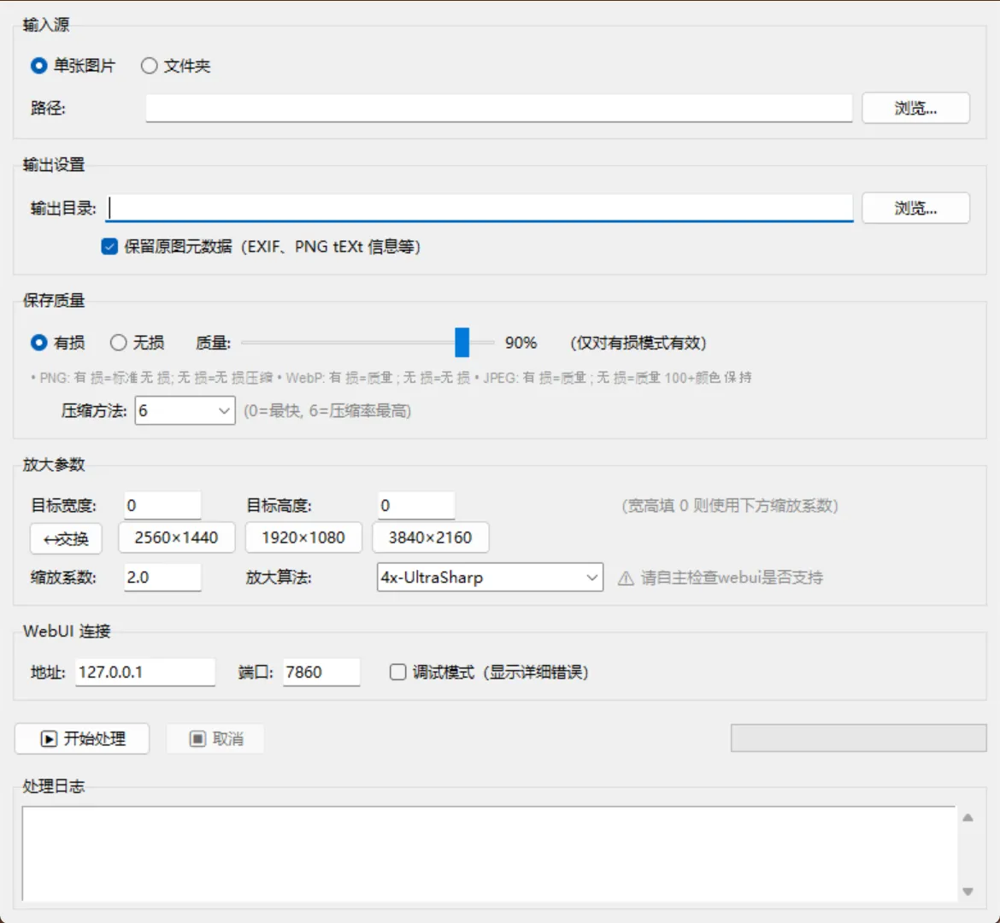

# WebUI Scale

WebUIScale，SD WebUI 图片放大助手，支持递归子文件夹，保留生成元数据

## 使用
1. SD WebUI 带 api 参数 启动
	1. 修改 webui-user.bat 增加 `--api` 参数
	2.  如 `set COMMANDLINE_ARGS=--uv --theme dark --api`
2. 运行程序
3. 选择图片或文件夹，调整参数，点击「开始处理」

## 截图


## 功能

- **输入**：支持单张图片或整个文件夹（可递归子目录）
- **预设**：一键填入 2560×1440 / 1920×1080 / 3840×2160，支持交换宽高
- **缩放**：指定目标尺寸或按比例放大
- **算法**：可选常见放大算法（4x-AnimeSharp、4x-UltraSharp、R-ESRGAN 等）或自己输入
- **元数据**：保留原图 EXIF 及 PNG tEXt 信息（WebUI parameters、ComfyUI prompt/workflow）
- **保存质量**：有损（百分比 1–100）/ 无损，WebP 压缩方法 0–6 可选
- **进度**：实时日志 + 进度条，支持取消

## 提示
- 宽高填 0 时使用「缩放系数」按比例放大
- 放大算法中的 `4x-UltraSharp` 等需确认 WebUI 已安装对应模型
- 处理大量图片时 WebUI 需有足够显存

## 开发相关 
### 依赖
```bash
pip install webuiapi piexif
```
